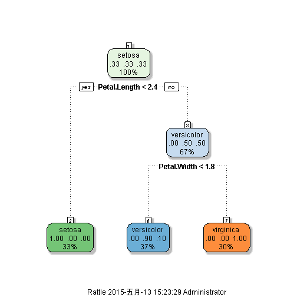

## Summary

In this presentation, we use methods learned in Machine Learning course to predict the classes of Iris data.
Let's look at the data first

```r
data(iris);library(ggplot2)
names(iris)
```

```
## [1] "Sepal.Length" "Sepal.Width"  "Petal.Length" "Petal.Width" 
## [5] "Species"
```

```r
table(iris$Species)
```

```
## 
##     setosa versicolor  virginica 
##         50         50         50
```

---  .class #id

## Create training and testing sets

```r
library(caret)
```

```
## Loading required package: lattice
```

```r
inTest<-createDataPartition(y=iris$Species,p=0.25,list=FALSE)
training<-iris[-inTest,]
testing<-iris[inTest,]
dim(training);dim(testing)
```

```
## [1] 111   5
```

```
## [1] 39  5
```

---  .class #id

## Plot trees

```r
library(rpart);library(rattle)
fit<-train(Species~.,method="rpart",data=training)
fancyRpartPlot(fit$finalModel)
```

 

---  .class #id

## Check the accuracy of prediction

```r
result<-predict(fit,newdata=testing)
confusionMatrix(testing$Species,result)
```

```
## Confusion Matrix and Statistics
## 
##             Reference
## Prediction   setosa versicolor virginica
##   setosa         13          0         0
##   versicolor      0         12         1
##   virginica       0          1        12
## 
## Overall Statistics
##                                           
##                Accuracy : 0.9487          
##                  95% CI : (0.8268, 0.9937)
##     No Information Rate : 0.3333          
##     P-Value [Acc > NIR] : 7.509e-16       
##                                           
##                   Kappa : 0.9231          
##  Mcnemar's Test P-Value : NA              
## 
## Statistics by Class:
## 
##                      Class: setosa Class: versicolor Class: virginica
## Sensitivity                 1.0000            0.9231           0.9231
## Specificity                 1.0000            0.9615           0.9615
## Pos Pred Value              1.0000            0.9231           0.9231
## Neg Pred Value              1.0000            0.9615           0.9615
## Prevalence                  0.3333            0.3333           0.3333
## Detection Rate              0.3333            0.3077           0.3077
## Detection Prevalence        0.3333            0.3333           0.3333
## Balanced Accuracy           1.0000            0.9423           0.9423
```


